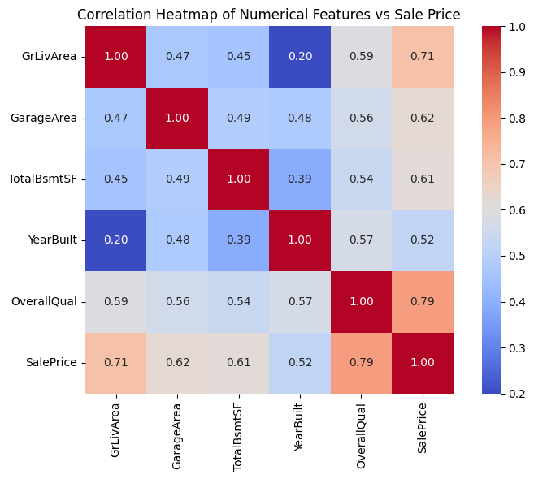
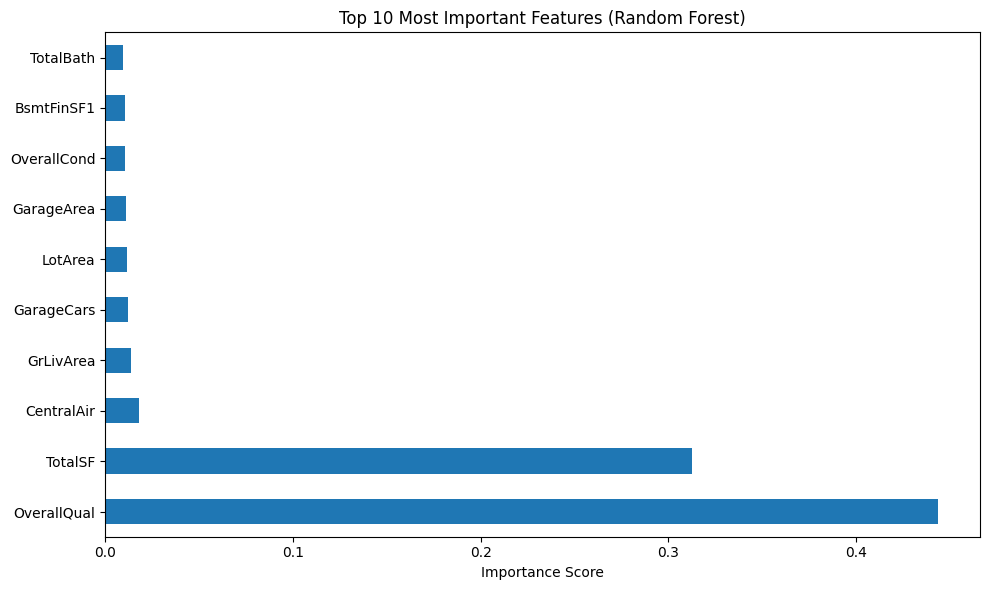
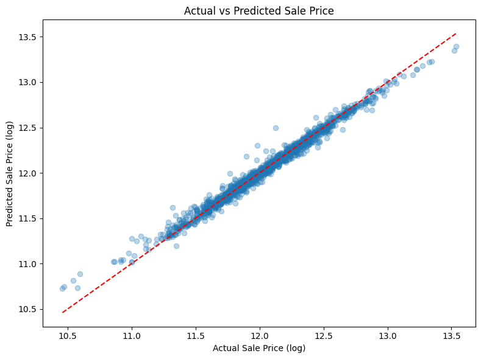

# House Price Prediction (Kaggle)

## Project Overview
Predicted house sale prices using the Kaggle House Prices dataset.
The target variable `SalePrice` is a continuous value, making this
a regression task. Focus areas include missing value handling,
feature engineering, multi-model comparison, and ensemble prediction.

---

## Dataset
- **Source**: [Kaggle House Prices Competition](https://www.kaggle.com/c/house-prices-advanced-regression-techniques)
- **Training set**: 1460 properties with sale price labels
- **Test set**: 1459 properties (labels hidden)
- **Target variable**: `SalePrice` (continuous, log-transformed during training)

---

## Project Pipeline
Raw Data → Data Cleaning → Feature Engineering
→ Model Training & CV → Ensemble → Submission

---

## 1. Data Cleaning
Train and test sets were merged for unified feature engineering.
Missing values were handled by column type:

| Column Type | Strategy |
|-------------|----------|
| Numeric | Median fill |
| Categorical | Filled with `'None'` |

---

## 2. Exploratory Data Analysis

Correlation heatmap was used to identify relationships between
numerical features and SalePrice, guiding feature engineering decisions.



Distribution of SalePrice across key categorical features
was examined using boxplots to identify high-impact variables.



---

## 3. Feature Engineering
New features created to improve predictive power:

| Feature | Description |
|---------|-------------|
| `TotalSF` | TotalBsmtSF + 1stFlrSF + 2ndFlrSF |
| `HouseAge` | YrSold - YearBuilt |
| `RemodelAge` | YrSold - YearRemodAdd |
| `TotalBath` | FullBath + 0.5×HalfBath + BsmtFullBath + 0.5×BsmtHalfBath |
| `HasGarage` | Binary flag: GarageArea > 0 |
| `HasBsmt` | Binary flag: TotalBsmtSF > 0 |
| `HasFireplace` | Binary flag: Fireplaces > 0 |

All categorical features were encoded using Label Encoding
prior to model training.

---

## 4. Model Training & Cross Validation
Four models were trained and evaluated using
**5-Fold Cross Validation** with RMSE on log-transformed SalePrice.

| Model | Parameters | CV RMSE |
|-------|-----------|---------|
| Random Forest | n_estimators=200, random_state=42 | 0.1415 |
| **Gradient Boosting** | **n_estimators=300, learning_rate=0.05, max_depth=4** | **0.1265** |
| Ridge | alpha=10 | 0.1495 |
| Lasso | alpha=0.001 | 0.1482 |

> RMSE is calculated on log-transformed SalePrice.
> Lower RMSE = better performance.

---

## 5. Model Evaluation

### Feature Importance
`OverallQual` had the highest impact among original features,
while the engineered feature `TotalSF` ranked second,
validating the decision to merge area-related features.

### Actual vs Predicted
Predicted values closely align with actual values across
the mid-range of the price distribution.
Slight deviation at extreme price ranges is consistent
with typical regression behaviour.



---

## 6. Ensemble & Submission
Final predictions were generated by averaging outputs from
Random Forest and Gradient Boosting:

```python
pred_log = (rf.predict(X_test) + gb.predict(X_test)) / 2
pred_price = np.expm1(pred_log)
```

Averaging two models with different learning mechanisms
reduces variance and typically improves generalisation
over a single model.

---

## 7. Results

| | Score |
|---|---|
| Random Forest CV RMSE | 0.1415 |
| Gradient Boosting CV RMSE | 0.1265 |

---

## Key Finding
`OverallQual` and engineered feature `TotalSF` were the top 2 predictors,
validating the feature engineering decisions driven by correlation analysis.

---

## Tech Stack
Python | Pandas | NumPy | Scikit-learn | Matplotlib | Seaborn
